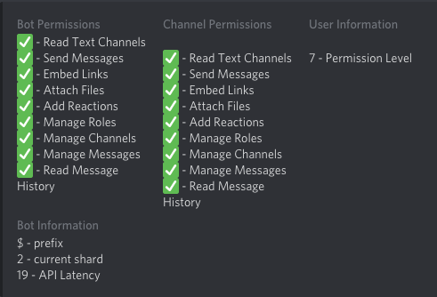
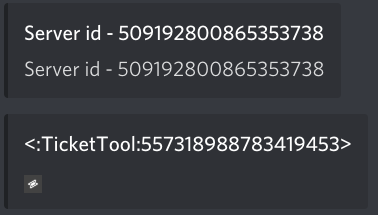

# Commands
Ticket Tool offers several commands to help you manage tickets.

>() = optional  
>[] = required  
> Default prefix is `$` Yours may be different  
> 💎 = Premium only command

> `user` parameter can be a mentioned user or their ID  
> `command` parameter can be mentioned or its ID

## Ticket Commands
### `$add [user] (channel)` - Add user to a ticket

### `$remove [user] (channel)` - Remove user from a ticket

### `$close` - Close a ticket

Must be run in the ticket channel.

### `$open` - Reopen a ticket

Must be run in the ticket channel.

### `$delete` - Delete a ticket

Must be run in the ticket channel.

### `$rename` - Rename a ticket channel

Must be run in the ticket channel.

### `$transcript (channel)` - Sends a transcript to optional channel

If omitted, transcript will be sent to current channel.  

### `$new (user) (reason)` - Create a new ticket

!> **[Command Style Tickets]() must be enabled!**

**`{reason}` must be included in the ticket's creation message to have an effect**

### `$claim` 💎 - Marks a ticket as claimed, or unclaimed

*Alias: `$unclaim`*

## Utility Commands
### `$help (topic)` - Shows help topics

Include topic name for more help.

### `$debug` - Sends a DM with the bot's permissions, prefix, shard and ping

*Alias:* `@Ticket Tool#4843 debug`

### `$id (@role | @user | #channel | emoji)` - Translate a mention/emoji into its ID

### `$ping` - Pong. Measure the bot's latency in your server

### `$permlevel` - Display your permission level of the bot

*Alias: `$level`*

### `$vote (link | unlink | redeem) (user)` - Vote for the bot!

**Linking**  
You can give your future votes to another user by linking with that user.

To link use `$vote link (@user or userId)`

To unlink use `$vote unlink`

**Redeeming**  
Each vote is worth 12 hours of premium and can be redeemed once you have at least 6 votes.

To redeem your votes, use `$vote redeem`

!> Only redeem in your _own_ server!

